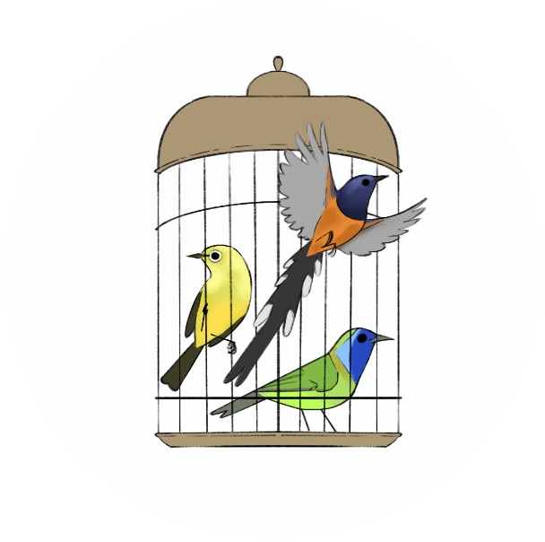

# 'cagedbirdID': Identifying birds in the wildlife trade 
This project has been part of my Master's by Research in the Durrell Institute of Conservation and Ecology at the University of Kent. My principal supervisor is [Dr. David Roberts](https://www.kent.ac.uk/anthropology-conservation/people/555/roberts-david) and [Julio Hernandez-Castro](https://www.kent.ac.uk/computing/people/3110/hernandez-castro-julio) in the School of Computing. 

## Additional information
For more information about our methods, processes of deduction and tool selection please contact [sicilyfiennes@gmail.com](mailto:sicilyfiennes@gmail.com). If you have a question related to the material presented here, please create a New Issue under the ‘Issues’ tab in the Github Repository. This work is currently being submitted for publication, and we will link any peer-reviewed work here when it is out.

You can also follow me and and my research on [Twitter](https://twitter.com/sicilyfiennes) or via my personal [blog](https://conservationsensationblog.wordpress.com/)

### Using GitHub Pages

This site uses the layout and styles from the Jekyll theme. To make a Github Page is actually very easy, customisable and quick to launch.
